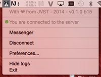
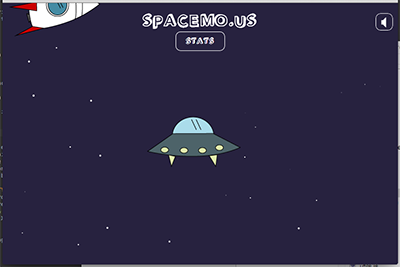

# Team Data Capture

An OSX app to retrieve users' input data & use it for something with Node.JS.
The app is tracking :
- mouse scroll
- left click
- mouse move

The app also has a messenger system, to send chat-type messages.

It comes with a contextual menu in the toolbar :



### Example app

The data can be used to display a spaceship per user ( for example ) : the spaceship follows the mouse movement, and shoots a missile on every left click.



## Installation

__openshift__ branch is for openshift deployment

**osx_app** branch is for OSX app

__master__ branch is for server development

### OSX App

##### APP
1. Open Xcode project
2. Product -> Archive
3. Export as Xcode Archive
4. Show package contents of archive
5. .app file will be in `Products/Applications/`

##### ACCESSIBILITY
To get the keyboard event to work, you'll need to authorize Xcode ( if dev mode ) or the compiled app to control your computer  
1. Go to System Preferences  
2. Open Security & Privacy section  
3. Add the app or Xcode ( if dev mode ) to the Accessibility list  

### Server
Load all the packages
```
$ cd server
$ npm install
$ bower install
```

Start Mongodb
```
$ mongod
```

Start the server using grunt allow you to use liveReload for the front end dev
```
$ grunt dev
```

Start the server using Node better log on for the backend dev
```
$ node server.js
```

## Configuration

The main configuration values are the web socket parameters.

### OSX App
A Preferences window is available to change Host & Port settings. Open it from the menu bar item.

### Server
Set your ip address and port in server/config.js
```
exports.ipaddress = '[your ipaddress]';
exports.port = '[your port]';
```

## Documentation

### API

We build a little api that allow you to recieve all of the events sent by the os application.  
Example:
```
var host = window.document.location.host.replace(/:.*/, ''),
port='9000';
var ws = new Socket();
ws.connect(host, port);

ws.events.addEventListener(`onmessage`, function(e) {
	console.log('listener: onmessage', e);
});
```

Here is the list of the events:
* `onmessage`: triggered every time a message is sent from the server
* `welcome`: triggered when the client connect the socket. it recieve the list of app_client connected.
* `newuser`: triggered when an new app_client connect.
* `closeuser`: triggered when an app_client disconnect.
* `mousemove`: triggered when an app_client move the mouse.
* `click`: triggered when an app_client click.
* `messenger`: triggered when an app_client sends a message
* `scroll`: triggered when an app_client scroll.

User specific event:
* `closeuser_[id]`: triggered when the app_client with the id=[id] disconnect.
* `mousemove_[id]`: triggered when the app_client with the id=[id] move the mouse.
* `click_[id]`: triggered when the app_client with the id=[id] click.
* `messenger_[id]`: triggered when the app_client with the id=[id] sends a message.
* `scroll_[id]`: triggered when the app_client with the id=[id] scroll.
